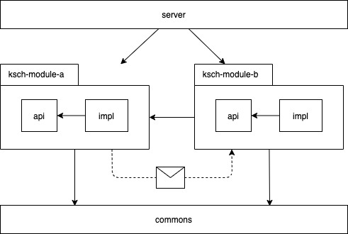

# K.S.C.H. Workflows Backend

Spring Boot application which provides a RESTful API for web, desktop, and mobile clients.

## Architecture

This section gives an overview of the code in this repository.
For further the big picture view, please refer to the K.S.C.H. Workflows architecture documentation.

### Technology stack

- Java 11
- Spring Boot
- MySQL
- Hibernate
- Gradle

### Module structure

The application is structured as a [modular monolith](https://www.youtube.com/watch?v=BOvxJaklcr0).
For the module definition, Gradle's multi-project functionality is being used.

The following diagram gives an overview of the project's module structure:

The "server" module contains the `main` function of the Java application.
It has a dependency on all the other modules so that their JAR files will be on the classpath when the application starts.

The business logic is contained in a range of modules with the prefix "ksch".
This prefix is being used to distinguish the business-related modules from the technical modules and directories which contain miscellaneous files.
Each business module contains two nested sub-modules, one with the suffix "api" and one with the suffix "impl".
Those sub-modules enable a clear distinction which classes of a module can be accessed from another module.
For example, when "ksch-module-b" has a dependency on "ksch-module-a", it can only use the classes which are included in the "api" sub-module.

Circular dependencies between the modules are not allowed, i.e. when "ksch-module-b" has a dependency on "ksch-module-a", there cannot be a module dependency the other way round.
However, it may be that "ksch-module-b" needs to do something when something in "ksch-module-a" happens.
In this case, "ksch-module-a" cannot trigger this directly, since it doesn't know anything about "ksch-module-b".
The only thing it can do is to publish an [application event](https://spring.io/blog/2015/02/11/better-application-events-in-spring-framework-4-2) which can be listened to by "ksch-module-b".
Based on this event, "ksch-module-b" can decide what needs to happen when the event occurs.

Business modules may further depend on sub-modules in the "commons" module for abstract utilities.

### Repository structure

- `.github`: Definition of the build process
- `docs`: Source files for the REST API documentation
- `commons`: Shared code between the `ksch-*` domain modules
- `ksch-billing`: Domain module for billing related workflows
- `ksch-patient-management`: Domain module for patient-related workflows
- `server`: Sub-project which contains the application's entry point, global configuration, and database migrations.

## License

K.S.C.H. Workflows is maintained by [KS-plus e.V.](https://ks-plus.org/en/welcome/),
a non-profit association dedicated to supporting the [Kirpal Sagar](https://kirpal-sagar.org/en/welcome/) project.

It is licensed under the [Apache License Version 2.0](https://github.com/ksch-workflows/ksch-workflows/blob/master/LICENSE).
