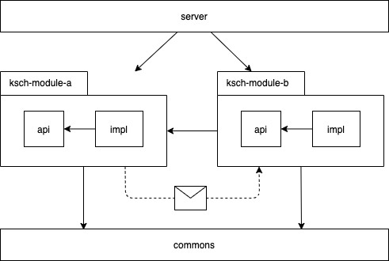

# K.S.C.H. Workflows Backend

[](https://gitter.im/ksch-workflows/community?utm_source=badge&utm_medium=badge&utm_campaign=pr-badge&utm_content=badge)

This repository contains the source code for the backend of web browser, desktop, and mobile clients.
They can access the queries and commands which they need via a RESTful API.

## Architecture

This section gives an overview of the code in this repository.
For further the big picture view, please refer to the [K.S.C.H. Workflows architecture documentation](https://ksch-workflows.github.io/arc42).

### Technology stack

- Java 11
- Spring Boot
- MySQL
- Hibernate
- Gradle

### Module structure

The application consists of two kinds of modules:
First, there are business modules that provide the functionality required by the system's users.
Second, there are technical modules that provide a scaffold for the business modules.

The following diagram gives an overview of the project's module structure:



The "server" module contains the `main` function of the Java application.
It has a dependency on all the other modules so that their JAR files will be on the classpath when the application starts.

The business modules have the prefix "ksch".
In this way, they are easily distinguishable from the technical modules and the directories which contain miscellaneous files.
Each business module contains two nested sub-modules, one with the suffix "api" and one with the suffix "impl".
If one business module uses another, it can only use what's inside the "api" sub-module.

Circular dependencies between the modules are not allowed, i.e. when "ksch-module-b" depends on "ksch-module-a", there cannot be a module dependency the other way round.
However, it may be that "ksch-module-b" needs to do something when something in "ksch-module-a" happens.
In this case, "ksch-module-a" can listen to events published in "ksch-module-b".

Business modules may further depend on sub-modules in the "commons" module for abstract utilities.

### Repository structure

The following list gives an overview of the contents in the project's directories:

- `.github`: definition of the build process
- `docs`: source files for the REST API documentation
- `commons`: shared code between the `ksch-*` domain modules
- `ksch-billing`: domain module for billing related workflows
- `ksch-patient-management`: domain module for patient-related workflows
- `server`: the application's entry point, global configuration, and database migrations

## Development

### Add license comments

In order to add license header comments to all Java files which don't have them yet, you
can call the following shell script:

```
./docs/license/add-license-notices.sh
```

### Problems with module dependencies

If IntelliJ cannot resolve the dependencies between modules, then most likely this can be fixed by resetting
the caches or re-generating the project files.

[File > Invalidate caches]

```
find . -name "*.iml" -or -name "*.ipr" -or -name "*.iws" | xargs rm
./gradlew idea
```

## Maintenance

### Update API documentation

The [REST API documentation](https://ksch-workflows.github.io/backend/) for this project is hosted on GitHub
Pages via the `/docs` directory in this repository.

It can be updated by executing the following commands:

```
./gradlew test
./docs/api/build.sh
git add .
git commit -m "Update API documentation"
git push
```

### Deploy to staging environment

```
gcloud init
./gradlew appengineDeploy
```

## License

K.S.C.H. Workflows is maintained by [KS-plus e.V.](https://ks-plus.org/en/welcome/),
a non-profit association dedicated to supporting the [Kirpal Sagar](https://kirpal-sagar.org/en/welcome/) project.

It is licensed under the [Apache License Version 2.0](https://github.com/ksch-workflows/ksch-workflows/blob/master/LICENSE).
