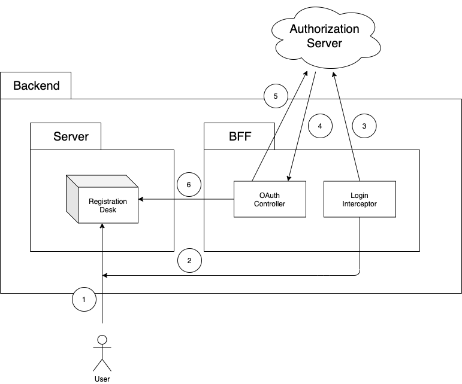
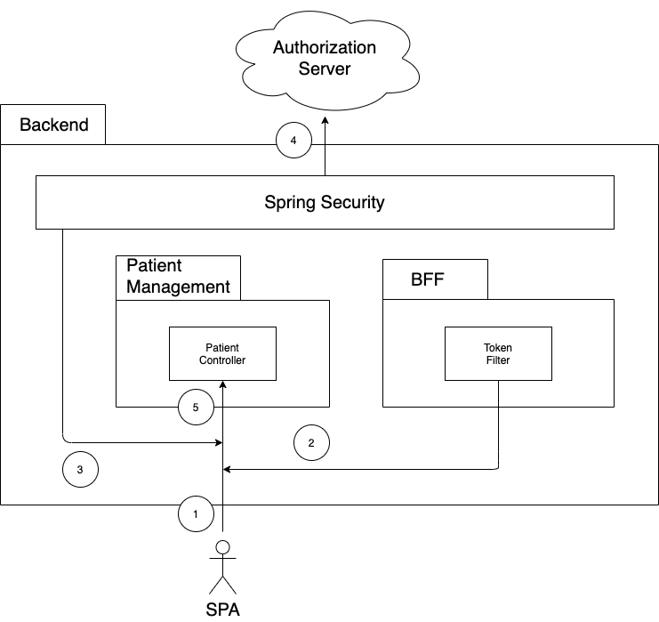
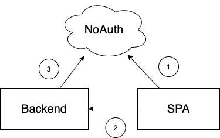

# Backend for Frontend

Modern web applications are often implemented as Single Page Applications (SPA) where the server provides only an Application Programming Interface (API) for the raw data instead of rendering the contents website.
The frontend takes this raw data and dynamically generates the graphical user interface of the website with JavaScript, the browser's scripting language.
The Backend for Frontend (BFF) module allows SPAs to create a session in which the access tokens for the backend's REST API are stored.

## Overview

### User authentication flow

When the users initially request access to a workstation website, they are redirected to the login process of the authorization server.
When the clients are redirected back to the backend, their session contains an access token.
Then they can proceed with working with the website.

_Diagram_:

_Details_:

1. The users request the workstation website, e.g. the one for the registration desk, in their browser.
2. That request is intercepted by the [`LoginInterceptor`](./src/main/java/ksch/bff/LoginInterceptor.java). The session gets automatically created and accessed via [Spring Session](https://docs.spring.io/spring-session/reference/index.html).
3. If there is no access token available in the user's session, they are redirected to the authorize URL of the authorization server. The intercepted URL gets stored in the session attributes.
4. After successful authentication and authorization, the authorization server redirects the client to the app's callback URL, with the authorization code as a query parameter.
5. With the authorization code grant and the app's client ID and client secret, the app calls the token endpoint of the authorization server to generate the access token.
6. After the access token has been stored in the user session, the user is eventually redirected to the originally intercepted URL.

### API access flow

After the users went through the authentification flow, their browser will have a session cookie with an identifier for the session which contains an access token. Whenever the SPA makes an HTTP request to the backend, the browser automatically adds this session cookie to the request. The BFF uses this session cookie to lookup the access token belonging to the session and then adds it to the HTTP request. The API request handler eventually reads the access token from the authorization header, exactly as it would do for API clients which add the authorization header explicitly.

_Diagram_:

_Details_:

1. When the users perform an action in the app, the app will make an HTTP call to the backend's API, e.g. `POST /patients` to create a new patient entity in the system.
2. Before that request is handled by the [`PatientController`](../ksch.patientmanagement/ksch.patientmanagement.impl/src/main/java/ksch/patientmanagement/http/PatientController.java) which will take care of the patient creation, the request is pre-processed by the [`TokenFilter`](./src/main/java/ksch/bff/TokenFilter.java). It reads the access token from the session belonging to the request. Then it adds the `Authorization` header with the access token to the request.
3. Afterwards, there will be yet another pre-processor before the request can be handled by the `PatientController`. Spring Security reads out the `Authorization` header from the request.
4. It then checks whether the signature included in the access token matches with the public signing key of the authorization server. If not, it declines further processing.
5. Eventually the request reaches the `PatientController` which calls the business logic required for the patient creation.

### Development flow

During development, the server which hosts the SPA is a different one than the one which hosts the API, i.e. the SPA and the API are running on different domains.
For security reasons, the browser restricts the setting and sending of cookies to websites running on the same domain and the concept described above is not applicable.
So, instead of relying on the BFF to enrich the API requests with the authorization header, the SPA is sending the authorization header by itself.
This process is enabled by a [mock authorization server](https://github.com/ksch-workflows/noauth) (NoAuth) which allows the generation of access tokens without providing real credentials and which permits the usage of any access token that gets provided.

_Diagram_:

_Description_:

1. Using mock credentials, the SPA makes a POST request to the `/token` endpoint of the NoAuth server and receives an access token in response.
2. When the SPA makes an HTTP call to the backend, it adds this access token as the authorization header to the request.
3. In development mode, the backend is configured to use [opaque token validation](https://docs.spring.io/spring-security/reference/servlet/oauth2/resource-server/opaque-token.html#oauth2resourceserver-opaque-architecture). When it receives the token, it makes a POST request to the `/token-info` endpoint of the NoAuth server which confirms the validity of any provided token.

## References

**BFF pattern**

- https://blog.bitsrc.io/bff-pattern-backend-for-frontend-an-introduction-e4fa965128bf
- https://curity.io/resources/learn/the-token-handler-pattern/
- https://samnewman.io/patterns/architectural/bff
- https://thenewstack.io/secure-the-web-with-an-api-driven-backend-for-frontend/
- https://www.youtube.com/watch?v=zazeGmFmUxg
- https://github.com/IBM/spring-backend-for-frontend
- https://www.thoughtworks.com/insights/blog/bff-soundcloud
- https://www.youtube.com/watch?v=GCx0aouuEkU

**OAuth**

- https://datatracker.ietf.org/doc/html/rfc6749
- [Add Login Using the Authorization Code Flow | auth0.com](https://auth0.com/docs/login/authentication/add-login-auth-code-flow)
- https://curity.io/resources/learn/spa-best-practices/

**Spring**

- https://spring.io/projects/spring-security
- [Spring Session Reference documentation | docs.spring.io](https://docs.spring.io/spring-session/reference/index.html)
- [A Custom Filter in the Spring Security Filter Chain | baeldung.com](https://www.baeldung.com/spring-security-custom-filter)

**Miscellaneous**

- https://blog.ropnop.com/storing-tokens-in-browser
- [Using HTTP cookies | developer.mozilla.org](https://developer.mozilla.org/en-US/docs/Web/HTTP/Cookies)
- [Authoritative guide to CORS (Cross-Origin Resource Sharing) for REST APIs | moesif.com](https://www.moesif.com/blog/technical/cors/Authoritative-Guide-to-CORS-Cross-Origin-Resource-Sharing-for-REST-APIs/)
- https://medium.com/@pantpriyamvada/session-management-and-security-in-spa-d96f4a9e817e
- https://cheatsheetseries.owasp.org/cheatsheets/Session_Management_Cheat_Sheet.html
