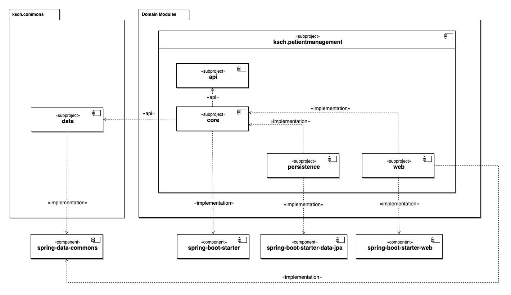

# Data Commons

> Anti-corruption layer for Spring Data Commons

## Overview

The "data" subproject provides facades and adapters for interfaces of the "spring-data-commons" dependency.
It uses the "implementation" dependency configuration which allows the usage of "spring-data-commons" within the "data" subproject while still not allowing the usage of "spring-data-commons" in dependants of "data".

## Rationale

Ideally, the "core" subproject would contain only business logic, without any external dependencies.
However, some functionality that is used in Spring applications is used across all technical layers and would be impractical to implement from scratch with a purse dependency separation.
In particular, the `Pagable` interface can be used to get paged data from the database and then render it in the REST API responses.
So, this approach allows the "data" subproject to define facade interfaces for the interfaces from "spring-data-commons".
Those facade interfaces can then be used in the repository interfaces defined in the "core" subproject.
The "persistence" subproject then implements the repository interface and uses the adapters from the "data" subprojects to convert the `Pageable` implementation from Spring into the facade interface used by the "core" subproject.
Similarly, the "web" subproject converts the `Pageable` implementation from Spring into the facade interface from the "core" subproject when it calls methods on the repository bean.

**Also see**

- https://learn.microsoft.com/en-us/azure/architecture/patterns/anti-corruption-layer
- https://softwareengineering.stackexchange.com/questions/184464/what-is-an-anti-corruption-layer-and-how-is-it-used
- https://stackoverflow.com/questions/909264/ddd-anti-corruption-layer-how-to

## Gradle dependency configuration

This approach builds on top of the "api" and "implementation" dependency configuration options from Gradle.
In a nutshell, the "api" dependency configuration means that the dependants of a subproject can also use the dependency whereas the "implementation" dependency configuration means that the dependants of a subproject cannot automatically also use the dependency.

**Also see**

- https://docs.gradle.org/current/userguide/declaring_dependencies.html
- https://medium.com/agorapulse-stories/gradle-configurations-explained-4b9608dd5e35
- https://stackoverflow.com/questions/44413952/gradle-implementation-vs-api-configuration
